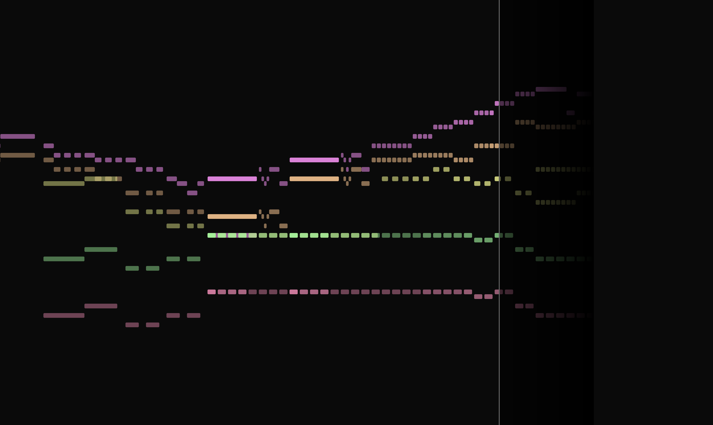

# Simple music visualiser

A piano scroll-style MIDI visualiser.

Uses [p5.js](https://p5js.org/) and [Tone.js](https://tonejs.github.io/).

Replace `test.mid` with another MIDI file you like.
The one here is by [Mike Blackstock](https://www.mutopiaproject.org/cgibin/piece-info.cgi?id=2230).
